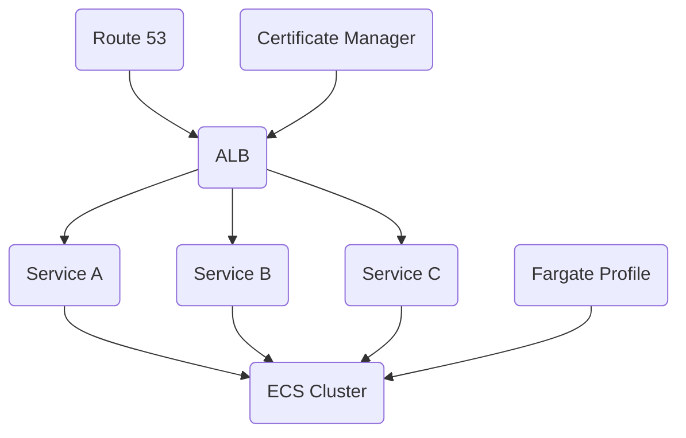

```mermaid
flowchart TD
    A(Route 53) --> B(ALB)
    C(Certificate Manager) --> B(ALB)
    B(ALB) --> D(Service A)
    B(ALB) --> E(Service B)
    B(ALB) --> F(Service C)
    D(Service A) --> G(ECS Cluster)
    E(Service B) --> G(ECS Cluster)
    F(Service C) --> G(ECS Cluster)
    H(Fargate Profile) --> G(ECS Cluster)

```